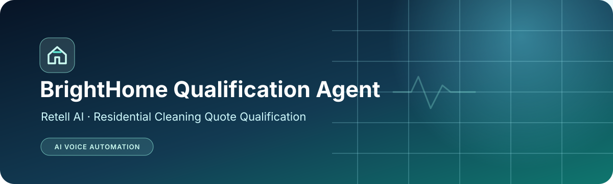
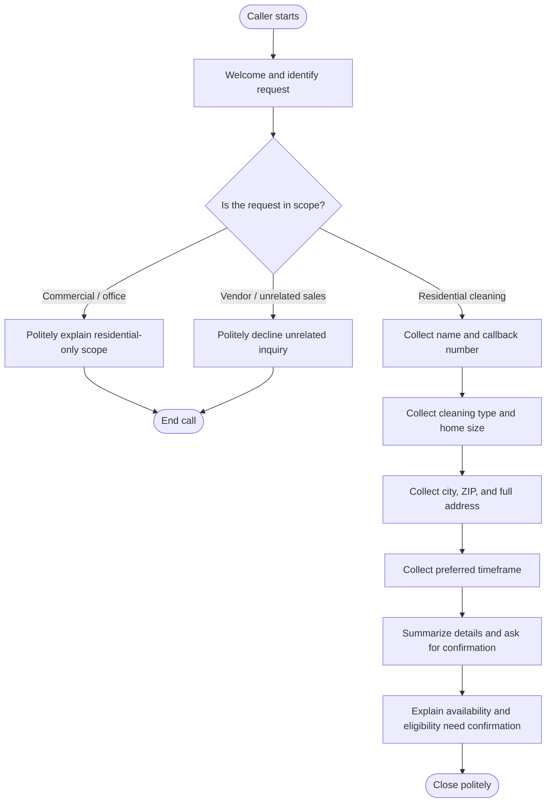

<!--
  BrightHome Qualification Agent
  Portfolio-ready project README
-->

  

  <h1>BrightHome Qualification Agent</h1>
  
<strong>A structured Retell AI voice agent for residential cleaning quote qualification.</strong>

  

    
    
    
    
  

  

    <a href="#-overview">Overview</a> •
    <a href="#-conversation-flow">Conversation Flow</a> •
    <a href="#-test-results">Test Results</a> •
    <a href="#-limitations--next-steps">Limitations</a> •
    <a href="#-documentation">Documentation</a>
  

---

## ✨ Overview

BrightHome Qualification Agent is an educational voice-agent project created for the **Tayana Academy Retell AI Topic 1 assessment**. It guides callers through a structured residential cleaning inquiry, captures essential details, handles out-of-scope requests politely, and confirms the information collected.

> **Demo:** [Watch the Loom walkthrough](https://www.loom.com/share/c957cb77299f4eb8915e8383ba405247)

### At a glance

| Item | Details |
| --- | --- |
| Voice platform | Retell AI |
| Agent setup | Single Prompt |
| Agent name | BrightHome Qualification Agent |
| Primary use case | Residential cleaning quote qualification |
| Prompt blueprint | Role & Persona → Conversation Goal → Disqualification Checks → Qualification Questions → Closing & Summary |
| Test evidence | Three dashboard simulation cases marked Passed |
| Deployment status | Educational prototype; live booking is not verified |

## 🎯 Project goals

- Collect the information needed to follow up on a residential cleaning quote.
- Ask one question at a time and use details the caller has already supplied.
- Handle information provided out of order without unnecessary repetition.
- Recognize commercial/office cleaning and unrelated vendor or sales inquiries as out of scope.
- Summarize captured details and ask the caller to confirm them.
- Avoid inventing service-area policies, availability, or appointment confirmations.

## 🧾 Information collected

- Full name
- Callback phone number
- Cleaning type
- Home size (bedrooms, bathrooms, or approximate square footage)
- Property service address
- City and ZIP code
- Preferred start timeframe
- Optional referral source

## 🔁 Conversation flow

## 🧪 Test results

The Retell AI dashboard showed these simulation cases as **Passed**:

| Test case | Dashboard result | What it checks |
| --- | --- | --- |
| Happy Path Test — Fully Qualified Caller | ✅ Passed | Sequential detail collection, confirmation summary, polite closing |
| Commercial Service Disqualification Test | ✅ Passed | Commercial/office request identified and ended without further qualification |
| Vendor / Spam Call Disqualification Test | ✅ Passed | Unrelated sales inquiry declined and call ended |

**Evidence note:** These are dashboard-reported simulation results. They do not establish that a live phone deployment or real appointment booking was tested.

## 🛡️ Safety and reliability choices

- Do not invent ZIP codes or claim an address is in/out of service area without verified reference data.
- Do not promise live availability or a confirmed appointment when no availability integration is configured.
- End out-of-scope inquiries politely instead of continuing qualification.
- Confirm captured caller details before closing a qualified inquiry.
- Treat official business data as a prerequisite for production use.

## ⚠️ Limitations & next steps

1. **Service-area ZIP list:** The supplied assessment materials did not include the official approved ZIP codes. Eligibility therefore needs confirmation.
2. **Supported-services list:** The complete official service list was not supplied. Commercial/office cleaning is treated as unsupported based on the assessment brief.
3. **Live scheduling:** Live availability lookup and appointment booking are not implemented or verified.
4. **Evidence:** Add sanitized Retell configuration and test-result screenshots to `docs/screenshots/` if permitted by the assessment. Do not include API keys, phone numbers, private caller data, or credentials.
5. **Production readiness:** Confirm business policies, service area, supported services, privacy/data-retention requirements, and scheduling integrations before real-world use.

## 📚 Documentation

- [Project documentation](docs/project-documentation.pdf)
- [LMS submission description](docs/lms-submission-description.txt)
- [Test results and evidence notes](docs/test-results.md)
- [Assessment limitations and next steps](docs/limitations.md)
- [Loom demo](https://www.loom.com/share/c957cb77299f4eb8915e8383ba405247)

## 🧰 Tech and concepts

`Retell AI` · `Voice Agents` · `Prompt Engineering` · `Conversation Design` · `Qualification Workflows` · `Post-Call Analysis`

## 👤 Author

**Shaik Mohammad Shaheed**  
AI & Automation | n8n | API Integration | Webhooks | AI Agents | Generative AI

- GitHub: [@shaikshahid777](https://github.com/shaikshahid777)
- Project repository: [retell-ai-brighthome-qualification-agent](https://github.com/shaikshahid777/retell-ai-brighthome-qualification-agent)

---

  Built as an educational assessment prototype. Business-specific data and production integrations must be verified before deployment.

